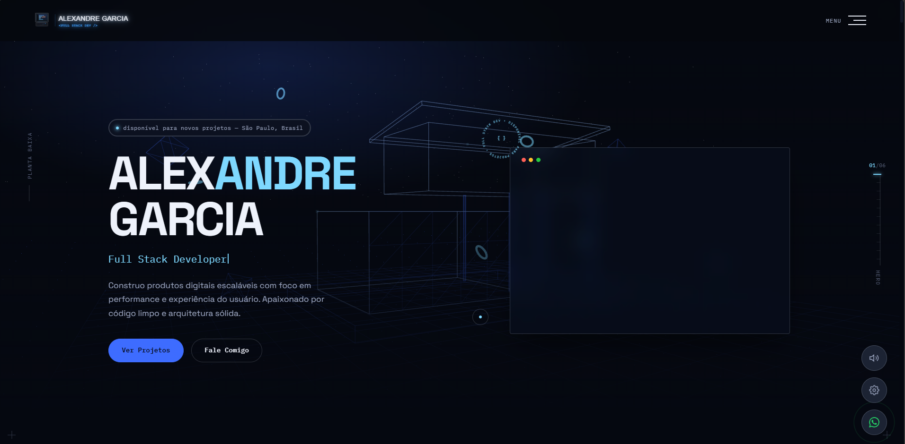

# Alexandre Garcia — Portfólio

> Portfólio profissional desenvolvido para apresentar minha trajetória, projetos, formação e atuação como desenvolvedor.

🌐 **[Ver Protótipo](https://alexandregarciajr.github.io/website-alexandregarcia.dev-v3.0/)**

---

## 📌 Sobre o projeto

Este projeto é o meu **portfólio pessoal como desenvolvedor**, criado para apresentar minha transição da área de Arquitetura e Urbanismo para o desenvolvimento de software.

O site reúne minha experiência profissional, formação, projetos acadêmicos e profissionais, além de canais de contato para oportunidades, freelas e colaborações.

A proposta visual combina uma estética **dark-tech / terminal** com elementos de interação, animações e experiências em 3D, buscando demonstrar não apenas os projetos desenvolvidos, mas também minha capacidade de criar interfaces modernas e experiências digitais.

---

## ✨ Principais características

* Design responsivo para desktop, tablet e mobile
* Interface dark-tech com identidade visual própria
* Animações e transições de página
* Scroll suave
* Efeitos de entrada e revelação de elementos
* Cursor e microinterações
* Menu responsivo para dispositivos móveis
* Experiência 3D utilizando WebGL
* Efeitos visuais desenvolvidos com JavaScript
* Sistema de temas visuais
* Player de áudio ambiente com diferentes trilhas
* Controle de volume e preferências persistentes
* Suporte à preferência `prefers-reduced-motion`
* Página dedicada para contato
* Links para GitHub, LinkedIn e contato direto
* Estrutura sem frameworks de UI, utilizando tecnologias Web nativas

---



<video src="./assets/video/gravacao-tela-1.5x.mp4" width="100%"
  controls
  muted
  loop
  playsinline>
</video>

---

## 🛠️ Tecnologias utilizadas

### Front-end

* HTML5
* CSS3
* JavaScript
* Web Audio API
* WebGL

### Bibliotecas

* **Three.js** — elementos e experiências 3D
* **GSAP** — animações
* **GSAP ScrollTrigger** — animações relacionadas ao scroll
* **Lenis** — scroll suave

### Design

* Space Grotesk
* IBM Plex Mono
* CSS Custom Properties
* Design responsivo
* Dark UI / Dark Tech

---

## 🎨 Experiência visual

O projeto foi desenvolvido com foco em uma experiência mais imersiva do que um portfólio tradicional.

Entre os recursos utilizados estão:

### Hero interativo

A seção inicial utiliza elementos visuais e animações para criar uma apresentação mais dinâmica.

### Experiência 3D

O site utiliza **Three.js** para criar elementos tridimensionais renderizados diretamente no navegador através de WebGL.

### Animações

As animações são controladas principalmente através de **GSAP e ScrollTrigger**, permitindo criar transições e efeitos sincronizados com a navegação do usuário.

### Smooth Scroll

O **Lenis** é utilizado para proporcionar uma experiência de rolagem mais fluida.

### Sistema de áudio

O site possui uma experiência sonora opcional, com diferentes trilhas ambientes:

* Sci-Fi Ambient
* Synthwave

As preferências do usuário são armazenadas localmente e o áudio pode ser controlado diretamente pela interface.

---

## 📂 Estrutura do projeto

```text
alexandregarcia-site/
│
├── index.html
├── contato.html
│
├── css/
│   └── style.css
│
├── js/
│   └── main.js
│
└── assets/
    ├── audio/
    │   ├── scifi-ambient.mp3
    │   └── synthwave.mp3
    │
    ├── img/
    │   ├── projetos
    │   ├── fotos
    │   └── imagens auxiliares
    │
    ├── svg/
    │   ├── logos
    │   └── favicon
    │
    ├── video/
    │   ├── contact-bg.mp4
    │   ├── contact-bg.webm
    │   └── frames/
    │
    └── vendor/
        ├── three.min.js
        ├── gsap.min.js
        ├── ScrollTrigger.min.js
        └── lenis.min.js
```

---

## 💼 Projetos apresentados

O portfólio apresenta diferentes projetos desenvolvidos durante minha formação e atuação como desenvolvedor, incluindo:

* **Teon App** — reformulação de UX/UI e funcionalidades do website
* **NRA** — website institucional para empresa de Geologia, Hidrogeologia, Geofísica e Meio Ambiente
* **Augusto Tomba** — portfólio artístico com estética minimalista japonesa
* **Mão na Massa** — plataforma para conectar clientes e prestadores de serviços
* **Bikecraft** — website voltado ao universo de bicicletas
* **Personal Trainer** — website para profissional autônomo
* **Foodi App** — aplicativo mobile de delivery desenvolvido com React Native
* **Projeto Banco DIO** — API bancária desenvolvida com Java e Spring Boot
* **Sistema de Loja de Eletrônicos** — API para controle de caixa desenvolvida com C#

---

## 👨‍💻 Sobre mim

Sou estudante de **Análise e Desenvolvimento de Sistemas pelo SENAC** e formado em **Arquitetura e Urbanismo pela Universidade Nove de Julho**.

Possuo experiência profissional na área de construção civil e arquitetura, atuando durante aproximadamente 12 anos com projetos, gerenciamento de obras, organização de equipes e desenvolvimento de soluções para diferentes tipos de empreendimentos.

Atualmente direciono essa experiência para a área de tecnologia, com foco no desenvolvimento de sistemas e aplicações Web.

Tenho interesse especialmente em:

* Desenvolvimento Front-end
* Desenvolvimento Back-end
* JavaScript
* Node.js
* APIs REST
* Java
* Spring Boot
* Arquitetura de software
* Desenvolvimento de aplicações Web

---

## 🚀 Objetivo do projeto

Além de funcionar como meu portfólio profissional, este projeto foi desenvolvido para aplicar na prática conceitos de:

* Desenvolvimento Web
* JavaScript
* Manipulação do DOM
* Responsividade
* Animações
* UX/UI
* Performance
* WebGL
* Organização de código
* Integração de bibliotecas
* Acessibilidade
* Experiência do usuário

---

## 📬 Contato

Se quiser conversar sobre projetos, oportunidades ou colaboração:

**E-mail:** [alexandregojunior@gmail.com](mailto:alexandregojunior@gmail.com)

**LinkedIn:** [Alexandre Garcia Junior](https://www.linkedin.com/in/alexandregarcia-junior/)

**GitHub:** [AlexandreGarciaJr](https://github.com/AlexandreGarciaJr)

---

## 📄 Licença

Este projeto representa meu portfólio pessoal e profissional.

O código pode ser utilizado como referência para estudos, mas os conteúdos, imagens, identidade visual e materiais pessoais apresentados no site não devem ser reutilizados sem autorização.
