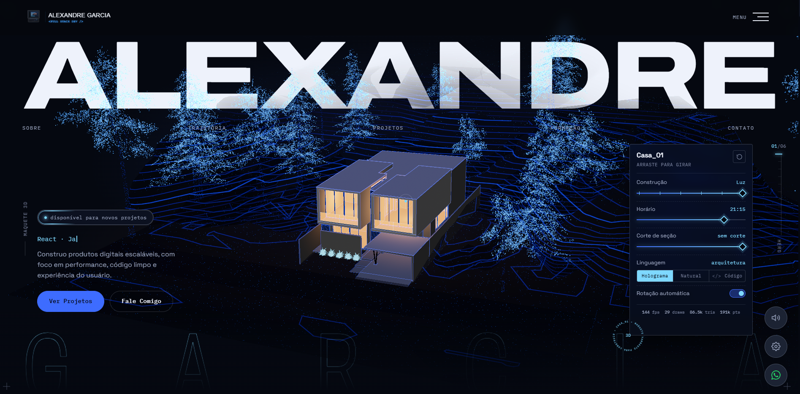
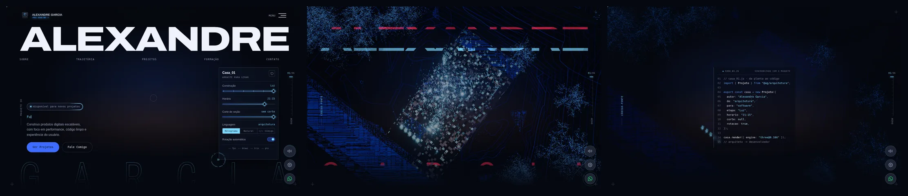
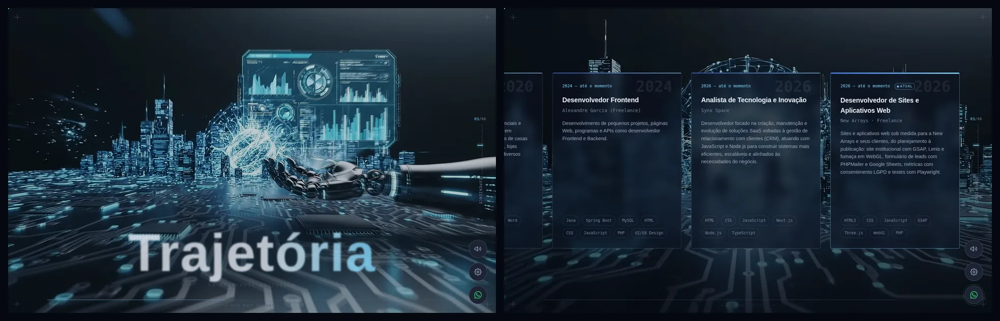
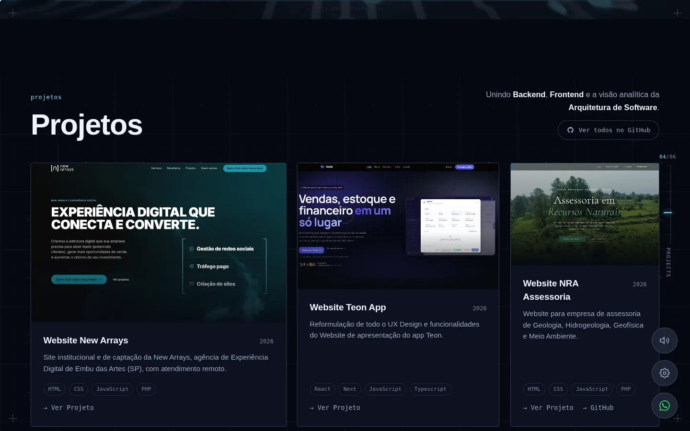
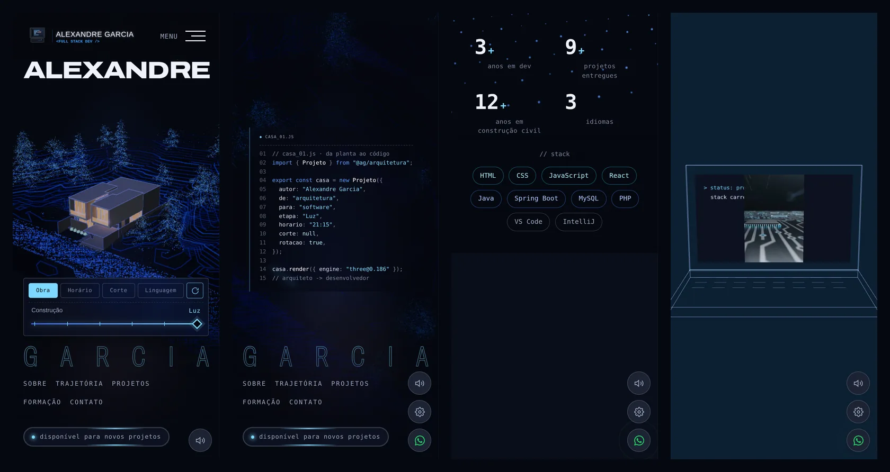

<div align="center">

# Alexandre Garcia

### Da planta ao código. Portfólio de um arquiteto que virou desenvolvedor.

**[alexandregarcia.dev →](https://alexandregarcia.dev/)**


</div>



## Sobre

Este é o meu portfólio pessoal. Sou formado em **Arquitetura e Urbanismo**, trabalhei 12 anos com projetos e obras e hoje sou desenvolvedor, estudando **Análise e Desenvolvimento de Sistemas no SENAC**.

O site conta essa história sem precisar de muito texto. Logo no topo há uma **maquete 3D de uma casa** e, quando você rola a página, ela se desfaz e vira **código-fonte**. É a minha transição de carreira acontecendo na tela.

Daí em diante, o site apresenta:

- quem eu sou;
- minha trajetória, de arquiteto a desenvolvedor na **New Arrays**;
- os projetos que entreguei;
- minha formação;
- um jeito direto de falar comigo.

O site está em três idiomas e funciona bem do celular ao monitor grande.

## Destaques

**Uma casa que vira código.** O topo tem uma maquete 3D de verdade, feita em Three.js, com um painel de parâmetros ao vivo:

- etapa da obra;
- horário do dia (a luz muda junto);
- corte de seção;
- visual Holograma ou Natural;
- rotação.

Ao rolar a página, ou ao clicar em "Código" no painel, a casa se desmancha em caracteres que voam e pousam formando um arquivo de código. Esse código usa os valores que estão no painel naquele momento.



**"Quem sou eu" com brilho próprio.** Um campo de partículas feito com shader, um brilho que acompanha o título em cada idioma e números que contam a minha história: anos de código, de obra, projetos e idiomas.


**Do notebook para a Trajetória, sem corte.** O notebook 3D que fecha o "Sobre" gira e a câmera mergulha na tela dele. O que aparece lá dentro é o primeiro quadro do vídeo da Trajetória, então as duas seções emendam sem salto. O título "Trajetória" é desenhado traço a traço e os cartões de experiência entram em sequência, até chegar ao cargo atual na New Arrays.



**Projetos em prancheta.** Os projetos ficam num grid editorial de 12 colunas. Os cartões inclinam de leve sob o mouse, com reflexo de luz, e o fundo da seção acende na cor do projeto em que você está.



**Contato que também é jogo.**

- **Formulário:** a página de contato tem um formulário completo, com validação em tempo real.
- **Quebra-Blocos:** no fim da página inicial, um clique transforma o fundo da seção num jogo feito em Canvas 2D. Dá para jogar com mouse, toque ou setas.


**Detalhes de interface.**

- **Áudio:** duas trilhas ambientes (Sci-Fi e Synthwave), com mute e controle de volume. Um aviso discreto chama para o primeiro clique.
- **Temas:** quatro cores de destaque (azul, esmeralda, âmbar e violeta).
- **Configurações:** um painel que reúne tema, idioma e trilha.
- **Loader:** desenhado com o logo do site.

## Feito com cuidado

| | |
|---|---|
| **Sem build** | HTML, CSS e JavaScript puro, sem framework e sem `npm install` para rodar |
| **Três idiomas** | Português, English e Español. Na primeira visita o idioma vem do navegador, e a escolha fica salva |
| **Mobile de verdade** | Versão própria para celular, com hero em coluna, mergulho no notebook em retrato e quadros mais leves. Ajustes específicos para Safari/iOS e para notebooks de tela baixa |
| **Acessibilidade** | `<main>` e títulos semânticos, menus que respeitam a tecla Esc e o foco do teclado, contraste revisado e respeito ao "reduzir movimento" do sistema |
| **Testado** | QA automatizado com Playwright em desktop, notebook e celular, incluindo auditoria de acessibilidade com axe-core |
| **Desempenho** | Maquete GLB otimizada para poucas chamadas de desenho, imagens comprimidas e carregamento sob demanda |
| **Compartilhamento** | Open Graph completo, para o link aparecer com imagem e ícone no WhatsApp e no LinkedIn |
| **Formulário seguro** | Validação no navegador e no servidor, checagem do domínio do e-mail, proteção contra robôs e envios repetidos. As credenciais nunca vão para o repositório |

**Tecnologias:**

- [Three.js](https://threejs.org) r186, com GLTFLoader, EffectComposer e UnrealBloom;
- shaders GLSL próprios;
- [GSAP](https://gsap.com) + ScrollTrigger;
- [Lenis](https://lenis.darkroom.engineering);
- Canvas 2D e Web Audio;
- [PHPMailer](https://github.com/PHPMailer/PHPMailer).



## Rodar localmente

Clone o repositório (ou baixe o .zip), entre na pasta e suba um servidor PHP:

```bash
cd alexandregarcia-site
php -S localhost:8000
```

Abra **http://localhost:8000**. O Live Server do VS Code também funciona, mas sem o envio do formulário.

Para o formulário enviar de verdade (o GitHub Pages não executa PHP):

1. Coloque o PHPMailer (`src/`) na raiz.
2. Copie `config.example.php` para `config.php`.
3. Preencha o `config.php` com o seu SMTP. No Gmail, use uma senha de app.

Os arquivos `.php` com dados sensíveis ficam fora do Git.

## Estrutura

```text
├── index.html              página principal
├── contato.html            página de contato
├── config.example.php      modelo das credenciais SMTP
├── site.webmanifest        ícone e cores do site
├── css/style.css           estilos
├── js/
│   ├── hero3d.js           maquete 3D e transformação em código
│   ├── main.js             animações, seções, áudio, menus e painel
│   ├── i18n.js             traduções PT / EN / ES
│   ├── contato.js          formulário e campo de pontos
│   └── quebra-blocos.js    mini-jogo da seção de contato
└── assets/
    ├── models/             maquete GLB da casa
    ├── video/              quadros da Trajetória (desktop e celular)
    ├── img/                fotos, projetos, logo e imagem de compartilhamento
    ├── audio/              trilhas ambientes
    ├── fonts/              Archivo variável
    ├── svg/                logos e favicon
    └── vendor/             GSAP, ScrollTrigger, Lenis e Three.js locais
```

Para adicionar um projeto, copie um cartão em `index.html` e ajuste as classes `c-3` a `c-7` para que cada linha do grid some 12. Para adicionar uma tradução, inclua o texto em português e as versões em inglês e espanhol no objeto `D` de `js/i18n.js`.

## Projetos no site

| Projeto | O que é | Stack |
|---|---|---|
| **New Arrays** | Site da agência de experiência digital | HTML, CSS, JS, PHP |
| **Teon App** | Reformulação de UX e funcionalidades do site do app | React, Next, TypeScript |
| **NRA Assessoria** | Site para empresa de geologia e meio ambiente | HTML, CSS, JS, PHP |
| **Augusto Tomba** | Portfólio de artista com estética minimalista japonesa | HTML, CSS, JS, PHP |
| **Maonamassa** | Plataforma que conecta clientes a prestadores de serviço | HTML, CSS, JS, PHP, SQL |
| **Bikecraft** | Site para o universo das bicicletas | HTML, CSS, JS, PHP |
| **Alexandre Personal** | Página de personal trainer autônomo | HTML, CSS, JS, PHP |
| **Foodi App** | App de delivery em React Native (projeto acadêmico) | React Native, TypeScript |
| **Banco DIO** | API bancária com documentação Swagger | Java, Spring Boot, MySQL |
| **Loja de Eletrônicos** | API de controle de caixa | C#, MySQL |

## Licença

O código pode ser usado como referência para estudo. Textos, fotos, identidade visual e demais conteúdos pessoais não devem ser reutilizados sem autorização.

---

<div align="center">

**[alexandregarcia.dev](https://alexandregarcia.dev/)**

[LinkedIn](https://www.linkedin.com/in/alexandregarcia-junior/) · [GitHub](https://github.com/AlexandreGarciaJr) · [E-mail](mailto:alexandregojunior@gmail.com)

</div>
