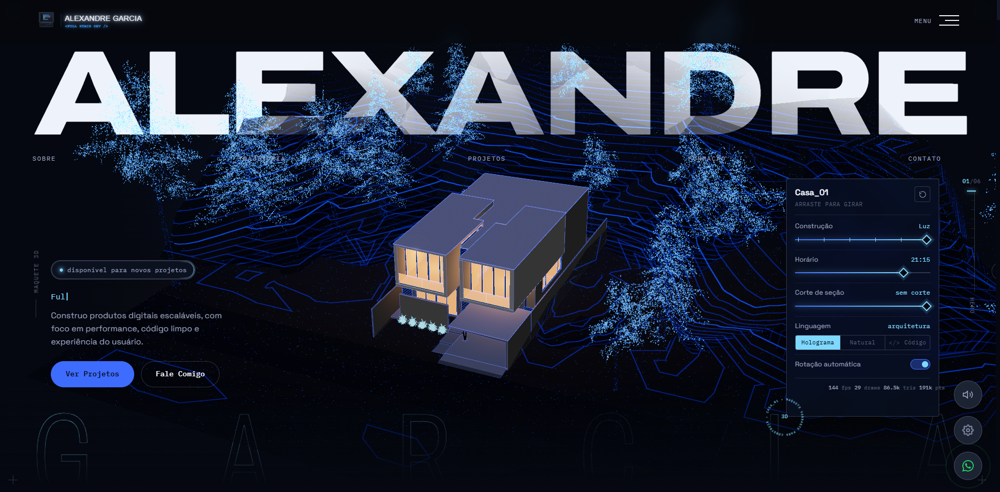

# Alexandre Garcia — Portfólio
 
> Portfólio profissional desenvolvido para apresentar minha trajetória, projetos, formação e atuação como desenvolvedor.
 
🌐 **[Ver Protótipo](https://alexandregarciajr.github.io/website-alexandregarcia.dev-v3.0/)**
 
---
 
## 📌 Sobre o projeto
 
Este projeto é o meu **portfólio pessoal como desenvolvedor**, criado para apresentar minha transição da área de Arquitetura e Urbanismo para o desenvolvimento de software.
 
O site reúne minha experiência profissional, formação, projetos acadêmicos e profissionais, além de canais de contato para oportunidades, freelas e colaborações.
 
A proposta visual combina uma estética **dark-tech / terminal** com elementos de interação, animações e experiências em 3D, buscando demonstrar não apenas os projetos desenvolvidos, mas também minha capacidade de criar interfaces modernas e experiências digitais. O hero, em especial, carrega o conceito central do site: uma maquete 3D de arquitetura que se transforma, diante do próprio visitante, em código-fonte — o resumo visual da minha própria transição de carreira.
 
---
 
## ✨ Principais características
 
* Design responsivo para desktop, tablet e mobile
* Interface dark-tech com identidade visual própria, tipografia grande e condensada no hero
* **Maquete 3D interativa (Three.js/WebGL)** de uma casa, com painel de parâmetros ao vivo: etapa da construção, horário do dia, corte de seção, modo Holograma/Natural, rotação automática
* **Casa → código-fonte**: no scroll ou por um botão do painel, a maquete se desfaz em glifos que voam e pousam formando um arquivo de código real, sincronizado com os parâmetros da cena
* **Transição contínua Sobre → Trajetória**: o notebook 3D da seção Sobre "mergulha" na própria tela até virar o primeiro frame do vídeo da Trajetória, sem corte entre as seções
* Sequência de vídeo (via frames) pinada por scroll na seção Trajetória, com título animado em SVG e cards de experiência com efeito de abertura de tela
* Animações e transições de página
* Scroll suave
* Efeitos de entrada e revelação de elementos
* Cursor e microinterações
* Menu responsivo para dispositivos móveis
* Efeitos visuais desenvolvidos com JavaScript e shaders GLSL customizados
* Sistema de temas visuais
* Player de áudio ambiente com diferentes trilhas
* Controle de volume e preferências persistentes
* Suporte à preferência `prefers-reduced-motion` em toda a experiência 3D e nas animações de scroll
* Página dedicada para contato
* Links para GitHub, LinkedIn e contato direto
* Estrutura sem frameworks de UI, utilizando tecnologias Web nativas
---
 

 
<video src="./assets/video/gravacao-tela-1.5x.mp4" width="100%"
  controls
  muted
  loop
  playsinline>
</video>
 
---
 
## 🛠️ Tecnologias utilizadas
 
### Front-end
 
* HTML5
* CSS3
* JavaScript (ES Modules no hero)
* Web Audio API
* WebGL / GLSL (shaders customizados via `onBeforeCompile`)
### Bibliotecas
 
* **Three.js** (r186, via CDN/import map) — maquete 3D do hero: OrbitControls, EffectComposer, RenderPass, UnrealBloomPass, GLTFLoader
* **Three.js** (build local, `assets/vendor/three.min.js`) — cenas 3D das demais seções (Sobre, Contato)
* **GSAP** — animações
* **GSAP ScrollTrigger** — animações relacionadas ao scroll, incluindo as sequências pinadas do hero e da Trajetória
* **Lenis** — scroll suave
### Design
 
* Archivo (variável, título do hero) / Space Grotesk
* IBM Plex Mono
* CSS Custom Properties
* Design responsivo
* Dark UI / Dark Tech
---
 
## 🎨 Experiência visual
 
O projeto foi desenvolvido com foco em uma experiência mais imersiva do que um portfólio tradicional.
 
Entre os recursos utilizados estão:
 
### Hero interativo — maquete 3D e código-fonte
 
A seção inicial apresenta uma tipografia gigante e um modelo 3D real de uma casa (`assets/models/casa.glb`, otimizado para poucos draw calls), com painel de parâmetros ao lado — construção, horário, corte de seção, material e rotação automática. Ao rolar a página, ou pelo botão "Código" do painel, a casa se desfaz e um bloco de código nasce das próprias arestas da maquete, letra por letra, como metáfora da transição de arquiteto para desenvolvedor.
 
### Transição Sobre → Trajetória
 
O notebook 3D que fecha a seção Sobre gira, sua tela se ajusta de frente para a câmera, e o mergulho na tela entrega exatamente o primeiro frame do vídeo que abre a Trajetória — as duas seções emendam sem vão perceptível. No frame em que uma mão aparece no vídeo, o título "Trajetória" é desenhado em SVG (traço → preenchimento) antes de dar lugar aos cards de experiência.
 
### Experiência 3D
 
O site utiliza **Three.js** para criar elementos tridimensionais renderizados diretamente no navegador através de WebGL — tanto no hero (build via CDN/ES Modules) quanto nas demais seções (build local em `assets/vendor`).
 
### Animações
 
As animações são controladas principalmente através de **GSAP e ScrollTrigger**, permitindo criar transições e efeitos sincronizados com a navegação do usuário.
 
### Smooth Scroll
 
O **Lenis** é utilizado para proporcionar uma experiência de rolagem mais fluida.
 
### Sistema de áudio
 
O site possui uma experiência sonora opcional, com diferentes trilhas ambientes:
 
* Sci-Fi Ambient
* Synthwave
As preferências do usuário são armazenadas localmente e o áudio pode ser controlado diretamente pela interface.
 
---
 
## 📂 Estrutura do projeto
 
```text
alexandregarcia-site/
│
├── index.html
├── contato.html
│
├── css/
│   └── style.css
│
├── js/
│   ├── main.js          # animações, scroll, seções, UI
│   └── hero3d.js         # cena 3D do hero (ES module, Three.js via CDN)
│
└── assets/
    ├── audio/
    │   ├── scifi-ambient.mp3
    │   └── synthwave.mp3
    │
    ├── fonts/
    │   └── archivo-wdth-*.woff2   # fonte variável do título do hero
    │
    ├── models/
    │   └── casa.glb                # maquete 3D otimizada da casa (hero)
    │
    ├── img/
    │   ├── projetos
    │   ├── fotos
    │   └── imagens auxiliares
    │
    ├── svg/
    │   ├── logos
    │   └── favicon
    │
    ├── video/
    │   ├── contact-bg.mp4
    │   ├── contact-bg.webm
    │   └── frames/                 # sequência de frames da Trajetória
    │
    └── vendor/
        ├── three.min.js            # Three.js (build local, demais seções)
        ├── gsap.min.js
        ├── ScrollTrigger.min.js
        └── lenis.min.js
```
 
---
 
## 💼 Projetos apresentados
 
O portfólio apresenta diferentes projetos desenvolvidos durante minha formação e atuação como desenvolvedor, incluindo:
 
* **Teon App** — reformulação de UX/UI e funcionalidades do website
* **NRA** — website institucional para empresa de Geologia, Hidrogeologia, Geofísica e Meio Ambiente
* **Augusto Tomba** — portfólio artístico com estética minimalista japonesa
* **Mão na Massa** — plataforma para conectar clientes e prestadores de serviços
* **Bikecraft** — website voltado ao universo de bicicletas
* **Personal Trainer** — website para profissional autônomo
* **Foodi App** — aplicativo mobile de delivery desenvolvido com React Native
* **Projeto Banco DIO** — API bancária desenvolvida com Java e Spring Boot
* **Sistema de Loja de Eletrônicos** — API para controle de caixa desenvolvida com C#
---
 
## 👨‍💻 Sobre mim
 
Sou estudante de **Análise e Desenvolvimento de Sistemas pelo SENAC** e formado em **Arquitetura e Urbanismo pela Universidade Nove de Julho**.
 
Possuo experiência profissional na área de construção civil e arquitetura, atuando durante aproximadamente 12 anos com projetos, gerenciamento de obras, organização de equipes e desenvolvimento de soluções para diferentes tipos de empreendimentos.
 
Atualmente direciono essa experiência para a área de tecnologia, com foco no desenvolvimento de sistemas e aplicações Web.
 
Tenho interesse especialmente em:
 
* Desenvolvimento Front-end
* Desenvolvimento Back-end
* JavaScript
* Node.js
* APIs REST
* Java
* Spring Boot
* Arquitetura de software
* Desenvolvimento de aplicações Web
---
 
## 🚀 Objetivo do projeto
 
Além de funcionar como meu portfólio profissional, este projeto foi desenvolvido para aplicar na prática conceitos de:
 
* Desenvolvimento Web
* JavaScript
* Manipulação do DOM
* Responsividade
* Animações
* UX/UI
* Performance
* WebGL e shaders GLSL
* Organização de código
* Integração de bibliotecas
* Acessibilidade
* Experiência do usuário
---
 
## 📬 Contato
 
Se quiser conversar sobre projetos, oportunidades ou colaboração:
 
**E-mail:** [alexandregojunior@gmail.com](mailto:alexandregojunior@gmail.com)
 
**LinkedIn:** [Alexandre Garcia Junior](https://www.linkedin.com/in/alexandregarcia-junior/)
 
**GitHub:** [AlexandreGarciaJr](https://github.com/AlexandreGarciaJr)
 
---
 
## 📄 Licença
 
Este projeto representa meu portfólio pessoal e profissional.
 
O código pode ser utilizado como referência para estudos, mas os conteúdos, imagens, identidade visual e materiais pessoais apresentados no site não devem ser reutilizados sem autorização.
 